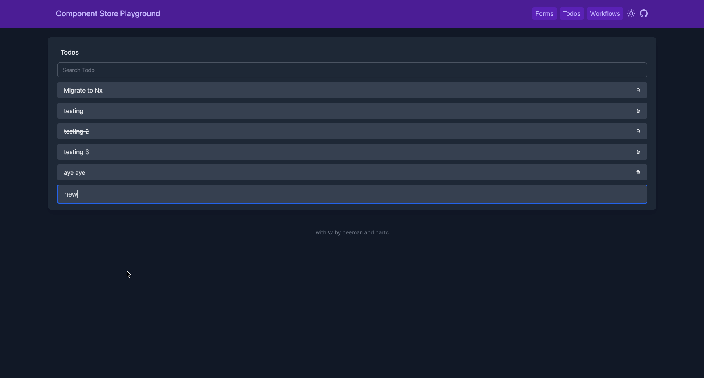

# Todos

This is an implementation of **ComponentStore** for a Todos demo



## State

```ts
interface TodosState {
  todos: ApiResponse<Todo[]>
  saving: boolean
  filter?: string
}
```

## Data Flow

- `loadTodosEffect` is invoked as soon as `TodosComponent` is initialized.
- `loadTodosEffect` calls `TodosService` to get the current todos then update the store with the response
- Interact with the `TodosStore` with: `addTodoEffect`, `toggleTodoEffect`, and `deleteTodoEffect`
