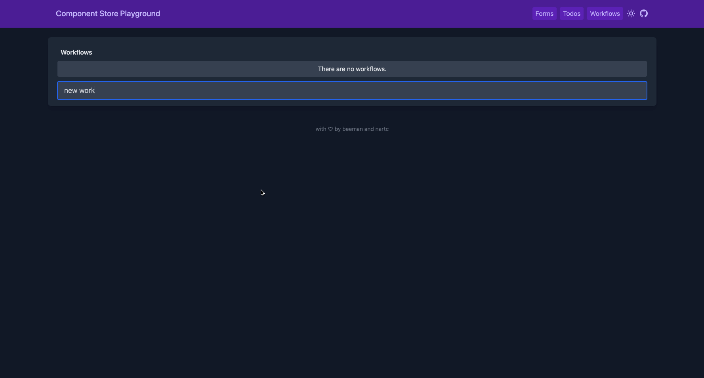

# Workflows

- Workflow is a set of conditions and groups of conditions.
- Workflow will always have a `group` that is the root of the condition tree.



## WorkflowList

### State

```ts
interface WorkflowListState {
  workflows: ApiResponse<Workflow[]>
  saving: boolean
}
```

### Data Flow

TBD

## WorkflowDetails

### State

```ts
/**
 * tree: {
 *   id: 1,
 *   parentId: null,
 *   type: group,
 *   children: [
 *     {
 *       id: 2,
 *       parentId: 1,
 *       type: group,
 *       children: [
 *         {
 *           type: 3,
 *           parentId: 2,
 *           type: condition
 *         }
 *       ]
 *     }
 *   ]
 * }
 *
 * groupNodes: {
 *   1: {
 *     type: group,
 *     parentId: null,
 *     children: [{id: 2, type: group}]
 *   },
 *   2: {
 *     type: group
 *     parentId: 1,
 *     children: [{id: 3, type: condition}]
 *   }
 * }
 *
 * conditionNodes: {
 *   3: {
 *     type: condition, value: true
 *   }
 * }
 */

interface WorkflowDetailsState {
  saving: boolean
  maxDepth: number
  workflow: ApiResponse<Workflow>
  groupNodes: Map<string, NormalizedWorkflowGroup>
  conditionNodes: Map<string, WorkflowCondition>
}
```

```ts
interface WorkflowGroupState {
  isCollapsed: boolean
  level?: number
  groupId?: string
}
```

```ts
interface WorkflowConditionState {
  conditionId: string
}
```

### Data Flow

TBD
