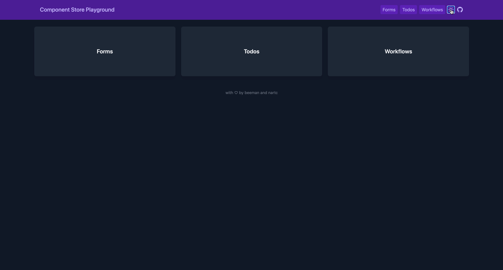

# UiStore

This is a global **ComponentStore** to manage our `UiState`



## State

```ts
type UiTheme = 'dark' | 'light'

interface UiState {
  theme: UiTheme
}
```

## Global

We use `providedIn: 'root'` for `UiStore` to make it a global store

## Data Flow

- `UiState.theme` is default to `UiTheme.dark`
- On initialize, we try to populate the store with a theme in `localStorage` if it exists
- On `toggleTheme`, we update `UiState.theme` as well as run a side-effect that would save the newly updated theme
  to `localStorage` and update `body.class`
